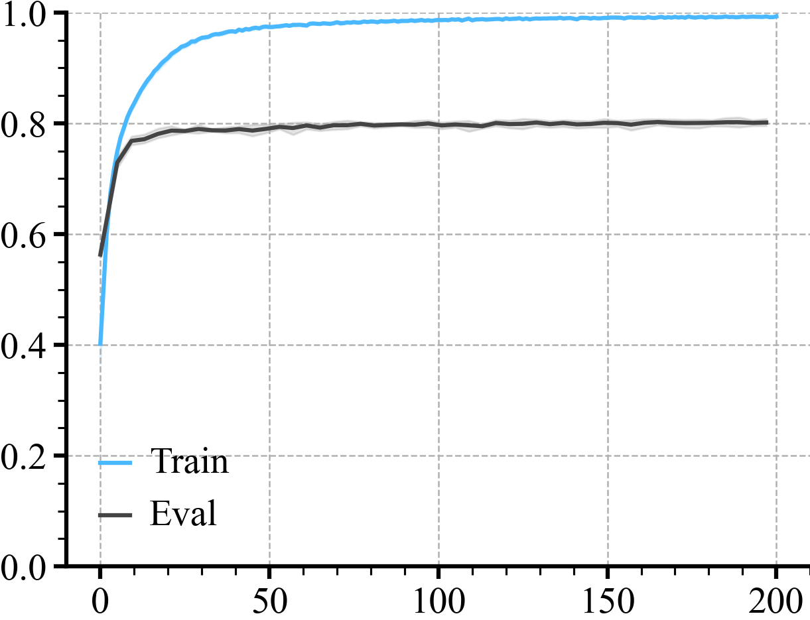

# CIFAR-10 Learning Curves

Results Over All Domains
Initialize the loader

```python
loader = ML_Logger(prefix="/lucid-sim/lucid-sim/matia/analysis/train/2024-01-15/14.17.38/14.17.38")
```
Check all the files 
```python
files = loader.glob(query="**/metrics.pkl", wd=".", recursive=True)
```
Plotting A Single Time Series 
```python
def group(xKey="epoch", yKey="train/episode_reward/mean", color=None, bins=50, label=None, dropna=False):
    avg, top, bottom, step = loader.read_metrics(
        f"{yKey}@mean",
        f"{yKey}@84%",
        f"{yKey}@16%",
        x_key=f"{xKey}@mean",
        path="**/metrics.pkl",
        num_bins=bins,
        dropna=dropna,
    )
    plt.plot(step, avg, color=color, label=label)
    plt.fill_between(step, bottom, top, alpha=0.15, color=color)
```

## Step 2: Plot

```python
title = "CURL"
colors = ["#49b8ff", "#444444", "#ff7575", "#66c56c", "#f4b247"]

with doc.table().figure_row() as r:
    group(yKey="train/top_1/mean", bins=None, dropna=True, color=colors[0], label="Train")
    group(yKey="eval/top_1/mean", color=colors[1], label="Eval")

    plt.legend(frameon=False)
    plt.ylim(0, 1)
    # plt.gca().xaxis.set_major_formatter(FuncFormatter(lambda x, _: f"{int(x / 1000)}k" if x else "0"))
    r.savefig(f"{Path(__file__).stem}/train_vs_eval.png", title="CFAIR-10 Learning Curves")
    plt.close()
```

| **CFAIR-10 Learning Curves** |
|:----------------------------:|
|  |
