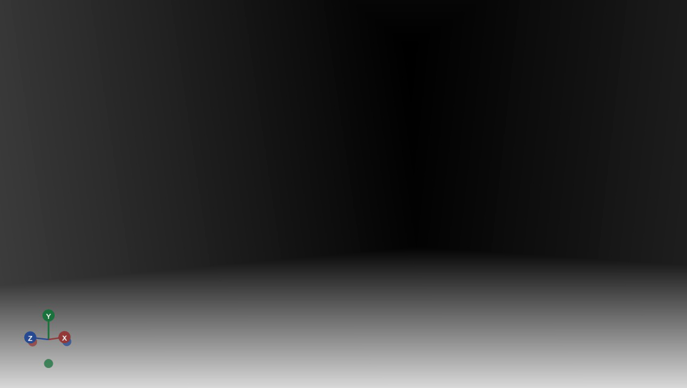
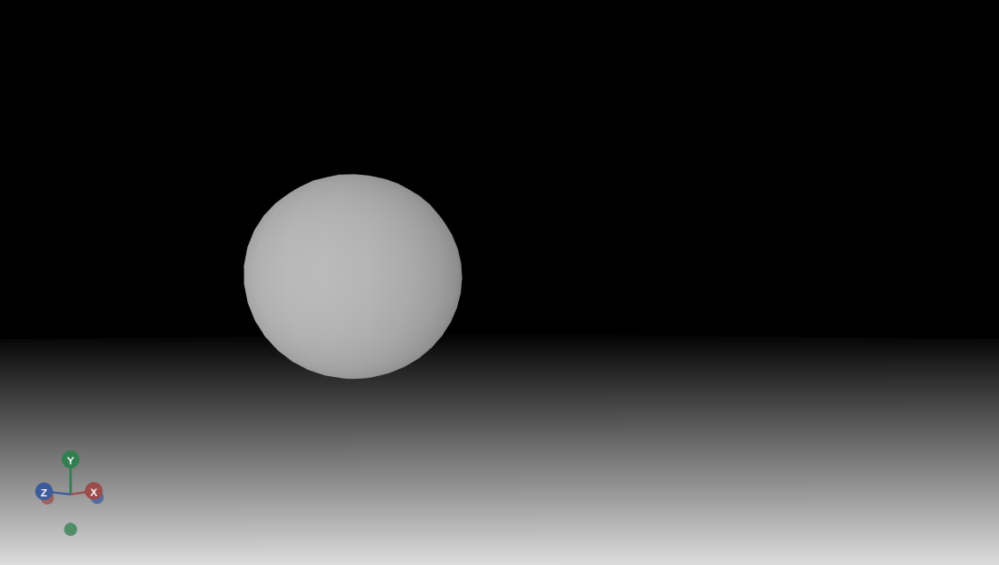
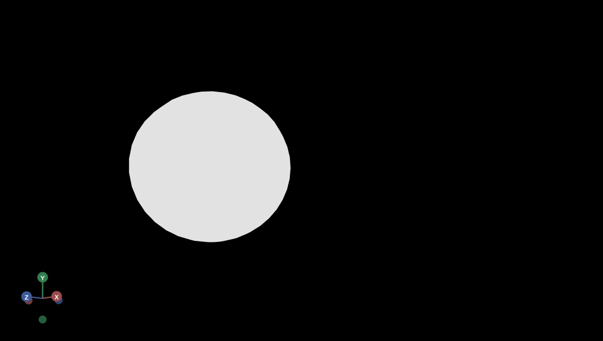

# Bouncy Ball





This example shows you how to build a simple curb, and after that, generate an image out of it.

Make an asset folder for the generated trimesh.
```shell
mkdir -p assets
```

Now, run

```python
from asyncio import sleep

from vuer import Vuer
from vuer.schemas import Scene, Box, Plane, Sphere

app = Vuer(static_root=f"{Path(__file__).parent}/assets")


# use `start=True` to start the app immediately
@app.spawn(start=True)
async def main(session):
    session.set @ Scene(
        Sphere(args=[0.5, 20, 20], position=[0, 1, 0], materialType="depth"),
        Plane(args=[100, 100], rotation=[-3.14 / 2, 0, 0], materialType="depth"),
    )

    while True:
        await sleep(1.0)
```

